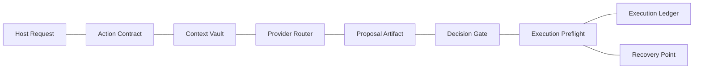

# Deterministic Agent Runtime Architecture

A public architecture showcase for deterministic agent runtimes.

This repository demonstrates how I design agent systems as bounded runtime architectures: explicit contracts, scoped context, provider routing, decision gates, execution safety, recovery points, and audit-ready records.

The focus is not on a specific product or domain. The focus is the engineering model behind reliable agent execution.

## What This Shows

- how to structure agent actions as versioned runtime contracts
- how to separate planning, approval, and execution readiness
- how to keep context retrieval scoped and traceable
- how to route model providers without giving providers system authority
- how to design tool connectors with capability boundaries
- how to record decisions in an execution ledger
- how to make recovery and rollback prerequisites explicit
- how to expose UI-ready read models without moving runtime authority into the UI
- how the same boundaries look as small, executable runtime code

## Runtime Posture

- Contracts define what can happen before anything runs.
- Context, provider choice, and tool access are explicit runtime decisions.
- Writes require approval, preflight, and recovery readiness.



## Repository Map

| Area | Purpose |
| --- | --- |
| [`docs/ARCHITECTURE.md`](docs/ARCHITECTURE.md) | Runtime layer overview. |
| [`docs/RUNTIME_CONTRACTS.md`](docs/RUNTIME_CONTRACTS.md) | Core contract model for actions, sessions, and work items. |
| [`docs/DECISION_GATE.md`](docs/DECISION_GATE.md) | Approval and preflight boundary. |
| [`docs/CONTEXT_VAULT.md`](docs/CONTEXT_VAULT.md) | Scoped context and memory retrieval model. |
| [`docs/PROVIDER_ROUTER.md`](docs/PROVIDER_ROUTER.md) | Provider/model routing boundary. |
| [`docs/TOOL_PERIMETER.md`](docs/TOOL_PERIMETER.md) | Tool connector capability model. |
| [`docs/OBSERVABILITY.md`](docs/OBSERVABILITY.md) | Execution ledger, structured logs, and audit records. |
| [`docs/RECOVERY_MODEL.md`](docs/RECOVERY_MODEL.md) | Snapshot and recovery point prerequisites. |
| [`docs/UI_CONTRACTS.md`](docs/UI_CONTRACTS.md) | UI-ready read models and host boundary. |
| [`examples/contracts/`](examples/contracts) | Sanitized contract examples. |
| [`examples/flows/`](examples/flows) | Example runtime flows. |
| [`diagrams/`](diagrams) | Mermaid architecture diagrams. |
| [`runtime-kernel/`](runtime-kernel) | Small TypeScript kernel for context selection, provider routing, preflight checks, and ledger records. |
| [`verification-suite/`](verification-suite) | Node verification suite for the runtime kernel. |

## Executable Kernel

The repository includes a compact TypeScript runtime kernel with no network calls, provider SDKs, or file writes:

- `context-vault/selectContextRecords.ts` selects scoped context and excludes local-only records from provider context
- `decision-gate/buildPreflightResult.ts` evaluates approval, recovery, path, and file type checks
- `provider-router/chooseProviderProfile.ts` makes deterministic provider-profile decisions
- `execution-ledger/createLedgerRecord.ts` creates stable ledger ids from canonical event input

Run the typecheck and verification suite:

```bash
npm run typecheck
npm run verify
```

## Example Contracts

The examples are sanitized. They show structure, not business logic.

- [`action-contract.example.json`](examples/contracts/action-contract.example.json)
- [`approval-ticket.example.json`](examples/contracts/approval-ticket.example.json)
- [`context-record.example.json`](examples/contracts/context-record.example.json)
- [`provider-decision.example.json`](examples/contracts/provider-decision.example.json)
- [`tool-connector.example.json`](examples/contracts/tool-connector.example.json)
- [`execution-ledger-record.example.json`](examples/contracts/execution-ledger-record.example.json)
- [`recovery-point.example.json`](examples/contracts/recovery-point.example.json)

## Intentional Boundaries

This repository does not include:

- proprietary product logic
- private operational data
- provider payloads
- secrets
- runnable production backend code
- write-capable execution code
- snapshot execution
- rollback execution
- domain-specific workflows

The artifact is the system shape: the runtime boundaries, safety model, and contract discipline.

## Author

Stefan Len  
