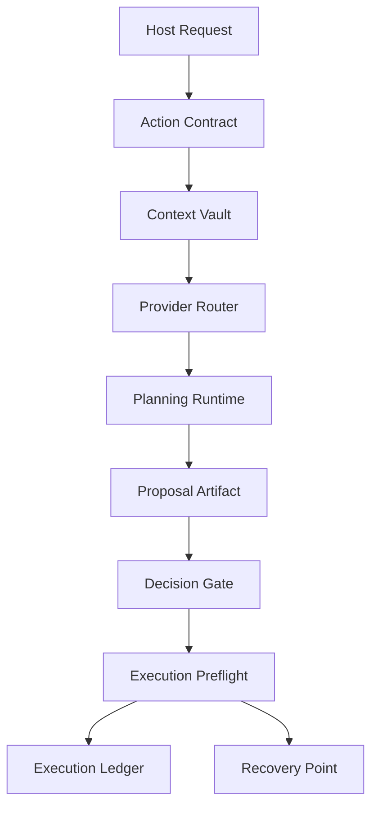

# Architecture

The runtime is organized around a small number of hard boundaries. Each boundary exists to keep agent behavior inspectable, testable, and recoverable.

## Layer Map

## Runtime Layers

### Action Contract Layer

Defines what the runtime can do. An action is not an instruction string. It is a versioned contract with input shape, context requirements, output expectations, safety gates, and tool permissions.

### Context Vault

Owns scoped context records. Retrieval is deterministic and traceable. Records are tagged by scope, visibility, source, and provider-safety level.

### Provider Router

Selects a provider/model profile. The provider can produce candidate output, but it does not own the system decision boundary.

### Planning Runtime

Produces normalized artifacts. The planning runtime creates structured outputs that can be audited and validated before any execution path exists.

### Decision Gate

Separates candidate work from approved work. Approval state is explicit, terminal transitions are controlled, and approvals can be linked to recovery requirements.

### Execution Preflight

Checks that approved work is still safe to execute. It verifies approval level, recovery point status, path boundaries, file type boundaries, and proposed change integrity.

### Execution Ledger

Stores structured records for meaningful runtime events. The ledger is not a raw transcript. It is a compact operational history that supports review and troubleshooting.

## Executable Kernel

The `runtime-kernel/` directory contains a small implementation of the same boundaries:

- deterministic context selection
- provider profile routing
- preflight decision checks
- stable ledger record creation

The implementation has no network calls, no provider SDK, no file writes, and no hidden runtime state.

## Design Constraint

No layer should depend on hidden conversational state. Every meaningful decision must be reconstructable from contracts, selected context, provider decision metadata, approval state, and ledger records.
