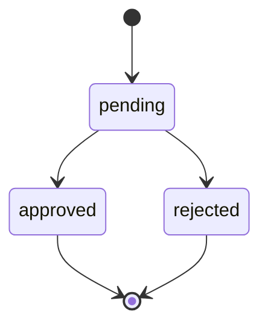

# Decision Gate

The decision gate is the boundary between proposed work and approved work.

## Approval Ticket

An approval ticket contains only the information needed to make and audit a decision:

- approval id
- linked action id
- artifact id
- approval level
- proposed change summary
- allowed path policy
- recovery requirement
- current decision
- decision actor metadata

See [`approval-ticket.example.json`](../examples/contracts/approval-ticket.example.json).

## Decision States

A typical decision lifecycle:

Terminal states should not be silently rewritten.

## Preflight Checks

Approval records the operator decision. Preflight checks whether that approved work still satisfies the runtime policy.

Typical checks:

- approval is approved
- approval level is one of `operator`, `maintainer`, or `system-owner`
- recovery point is prepared when required
- proposed changes are present
- allowed paths match the artifact
- allowed file types match the artifact
- path boundary is intact

## When This Is Wrong

The decision gate is the wrong layer for:

- mutating files
- retrying provider calls
- hiding failed checks behind a single boolean
- turning approval into execution authority

It should explain why work is ready or blocked. Execution belongs to a later boundary.
